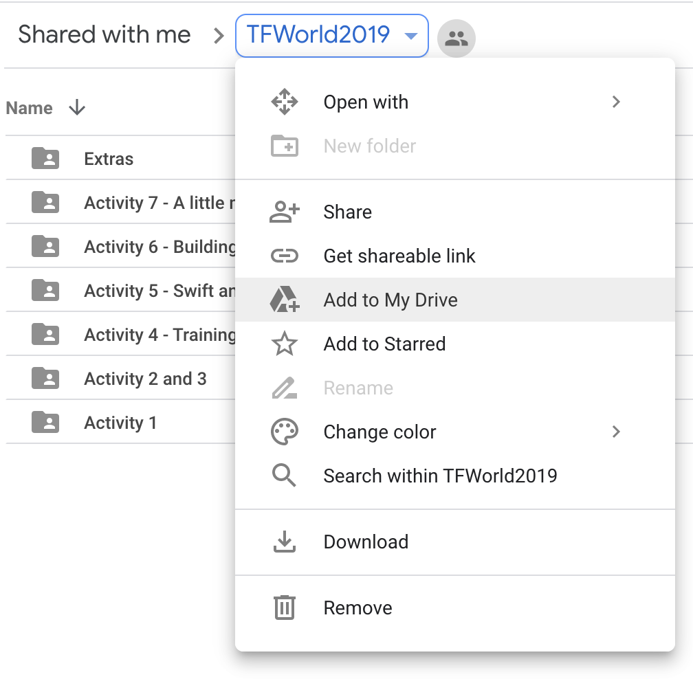
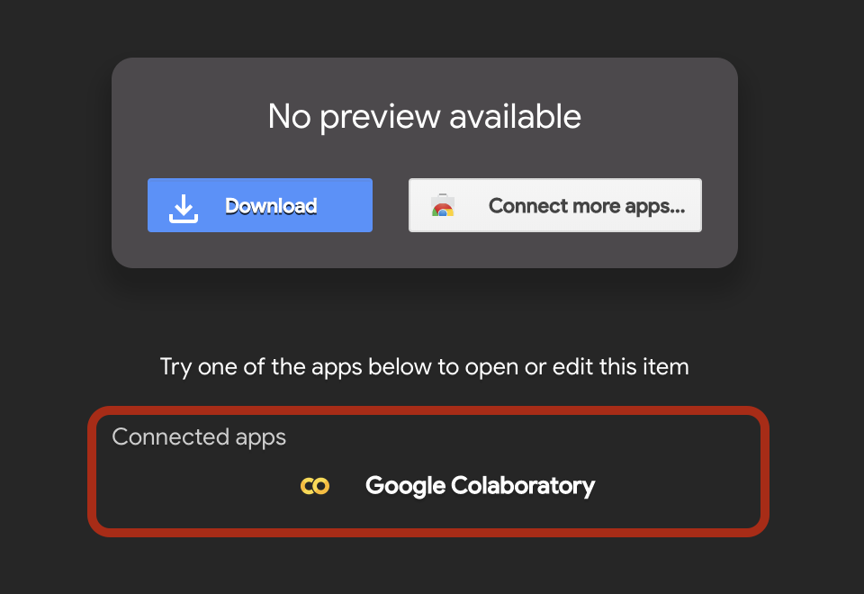
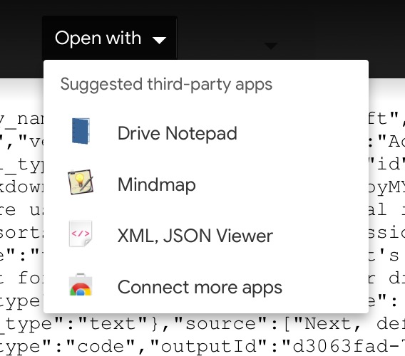
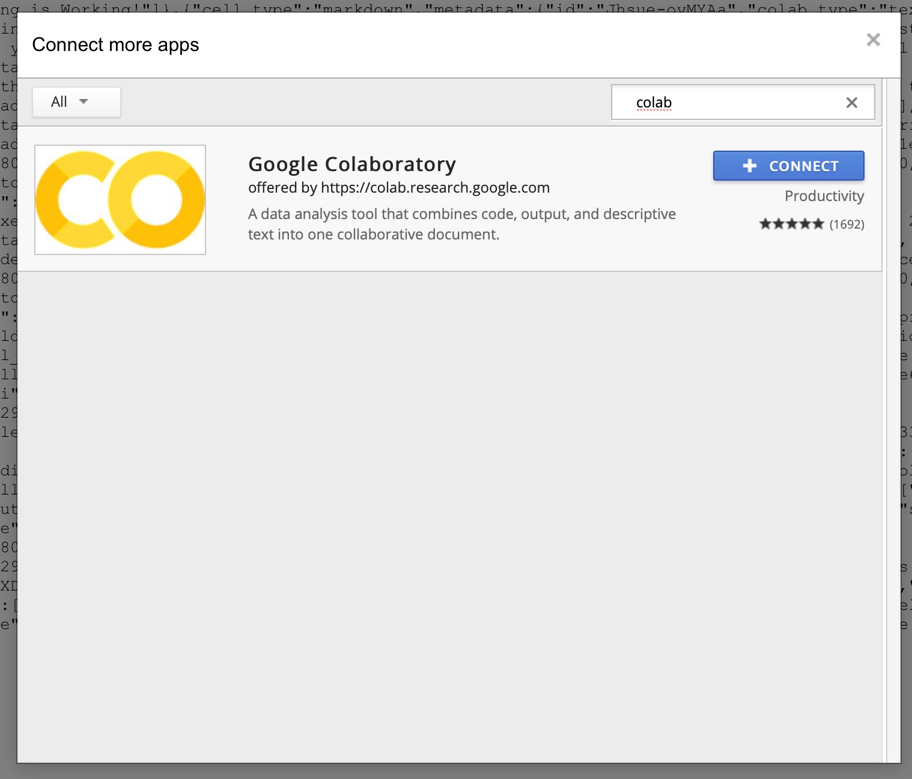
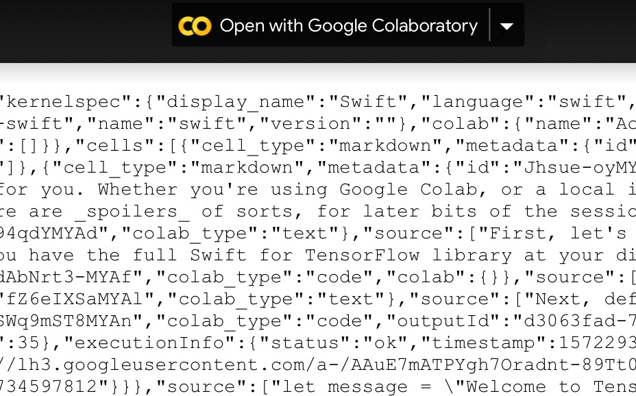
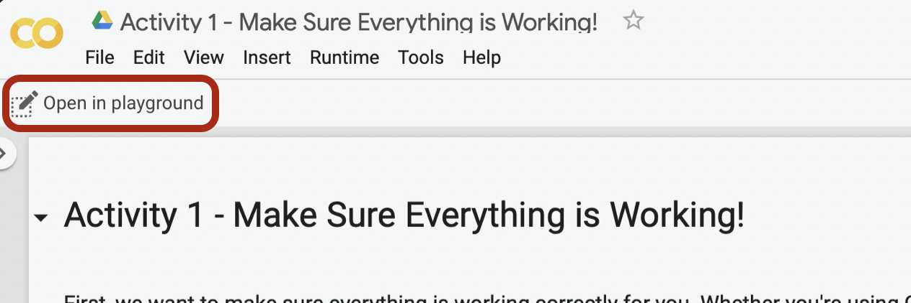

# Swift for TensorFlow in 3 Hours

## Quick Start

You won't need to go beyond this quickstart section if everything here works.

### To copy the tutorial notebooks into your Google Drive:

1. Open the shared Google Drive folder, containing the notebooks:
     * [https://lab.to/s4tf_tfworld_notebooks](https://lab.to/s4tf_tfworld_notebooks)

2. Add the shared `TFWorld2019` folder to _your_ Google Drive:
    * Click the dropdown next to the folders name, and then clicking "Add to My Drive", as shown in the image below.

  

3. Once the `TFWorld2019` folder is in _your_ Google Drive:
    * Open whichever notebook(s) you want to work with by double clicking them, and then clicking "Google Colaboratory", as shown in the image below.

      

    * If you see the notebook as raw text, click the "Open with" dropdown at the top, and click "Google Colaboratory", or if you don't see Colab as an option, click "Connect more apps":
    
      

    * Then add "Google Colaboratory":

      

    * Then open it with Colab:

      

4. Once your notebook is open, run it in Playground mode to allow cells to compile and run, as shown in the image below.

      

### To create a blank Swift notebook in Google Colab

Click on this link: [lab.to/s4tf_blank](http://lab.to/s4tf_blank)

_You'll need to save and name the notebook once you've created it!_