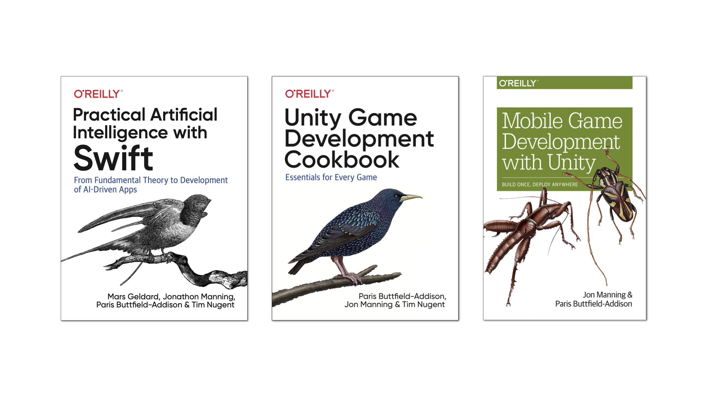
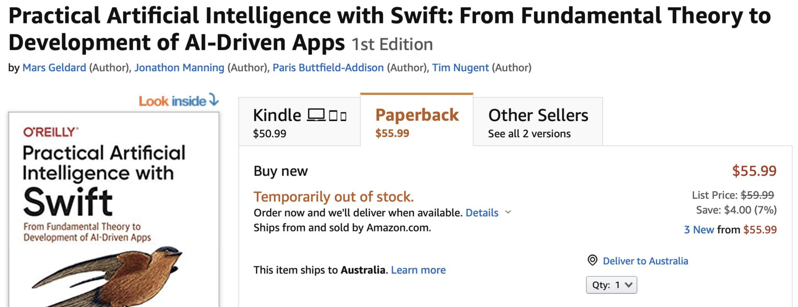
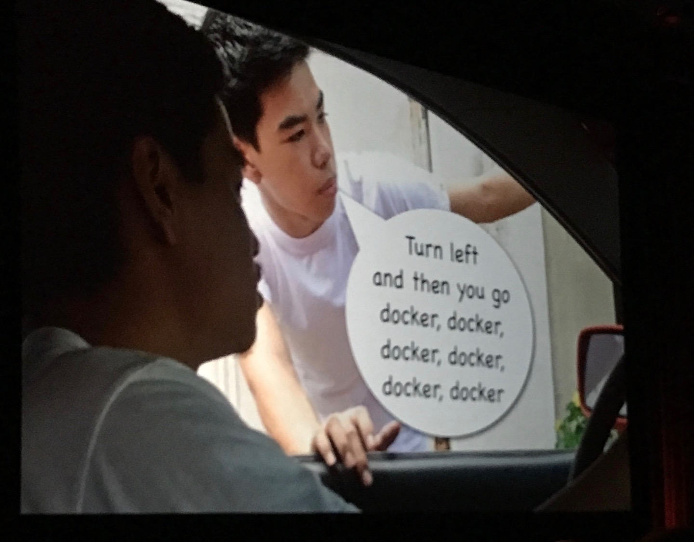

footer: @parisba / @the_mcjones / @themartianlife / #TFWorld
theme: Zurich,6
slidenumbers: true

# Swift for Tensorflow<br>(in three hours)

---

#[fit] 👋 Hello!

^ Hello!

---


---


---



---




---

[.build-lists: true]

# **Installation**

- `git clone https://github.com/google/swift-jupyter.git`
- `docker build -f docker/Dockerfile -t swift-jupyter .`
- `docker run -p 8888:8888 --cap-add SYS_PTRACE -v /my/host/notebooks:/notebooks swift-jupyter`

... so much Docker.

---



^... or use Google Colaboratory!

---

# Google Colaboratory
 
- Colab is a free, experimental data-science platform from Google
- It's basically a customised version of Jupyter Notebooks
- It's primarily Python
  - but the Swift for TensorFlow team appears to have bolted Swift into it as well!
  - it's a bit experimental, though
  
^ Originally, we weren't planning on using Colab for this session, but after spending a few weeks building the content we realised that, unless you have a truly powerful machine running Jupiter and the Swift Kernel locally, it really takes longer than is useful in a tutorial-setting to run any of the larger machine learning models. 

---

# [fit] Swift for TensorFlow isn't quite ready.

---

# [fit] Swift for TensorFlow isn't quite ready.
## It's _almost_ ready.

---

# [fit] Swift for TensorFlow isn't quite ready.
## It's _almost_ ready.
## _**almost**_

---

# [fit] Swift for TensorFlow isn't quite ready.
## It's _almost_ ready.
## _**almost**_
## ...Swift is **very** ready though!

---

# Today's Plan | **Activities**

* Activity 1: Making sure everything is working
* Activity 2: Getting familiar with Swift
* Activity 3: Slightly more advanced Swift
* Activity 4: Meet TensorFlow — Training a Model
* Activity 5: Swift and Python
* Activity 6: Building a GAN
* Activity 7: A little more Python

^ Throughout this plan, we're gonna be doing some activities, because, well, this is a tutorial! Our activities will be.... [advances one by one]. We may, or may not, get all the way through this.

---

# See the Googlers...

- 11:50 AM tomorrow
- Great American Ballroom J/K


---

# Why?

- performance!
- safety
- ease of reading
- fun
- looks kind of like Python most of the time
- performance
- performance

---

# Some Python...

```python
def collatz(n):
    count = 0

    while n > 1:
        if n % 2 == 0:
            n /= 2
        else:
            n = 3 * n + 1

        count += 1
    return count

print(f"it took {collatz(9)} steps to resolve")
```

---

# Some Swift...

```swift
func collatz(number: Int) -> Int {
    var count = 0
    var n = number
    
    while n > 1 {
        if n % 2 == 0 {
            n /= 2
        } else {
            n = 3 * n + 1
        }
        count += 1
    }
    return count
}
print("it took \(collatz(number: 9)) steps to resolve")
```

---

|Python|Swift|
|:---:|:---:|
|35.27 seconds|0.88 seconds|

^ py had a stddev of 2.6s
swift had a stddev of 0.13s
so a ~40x performance

---

|Python|Swift|C|
|:---:|:---:|:---:|
|35.27 seconds|0.88 seconds|0.0044 seconds|

^ I was curious so I rewrote it in C
knowing it would be faster
and was then confused why C was THAT much faster

---

^ so instead of reinterpreting Swift each time I compiled it once and ran that
so it is an apples to apples for Swift and C but not for poor Python
Swift is winning here but I only did 100 tests no where NEAR enough and we are talking about 4 nanoseconds here
worth saying this isn't a slight at Python, it was designed for writeability first

|Python|Swift|C|Swift compiled|
|:---:|:---:|:---:|:---:|
|35.27 seconds|0.88 seconds|0.0044 seconds|0.0040 seconds|


---

# **Swift (for programming)**

^ We're going to be teaching Swift, as a programming language, for the first bit of this tutorial. We're kind of just ignoring machine learning for this. It's important to learn Swift as a programming language before we move to Swift for TensorFlow.

---

# Let's go!
## Setup

- Go to this URL:

    https://lab.to/s4tf_tfworld2019


<!-- 
[.code-highlight: all]
[.code-highlight: 1]
[.code-highlight: 3,13]
[.code-highlight: 4-7]
[.code-highlight: 9-12]
[.code-highlight: 14]
[.code-highlight: 15]
[.code-highlight: 16]
[.code-highlight: 16-17]

```swift
import TensorFlow

struct MLPClassifier {
    var w1 = Tensor<Float>(repeating: 0.1, shape: [2, 4])
    var w2 = Tensor<Float>(shape: [4, 1], scalars: [0.4, -0.5, -0.5, 0.4])
    var b1 = Tensor<Float>([0.2, -0.3, -0.3, 0.2])
    var b2 = Tensor<Float>([[0.4]])

    func prediction(for x: Tensor<Float>) -> Tensor<Float> {
        let o1 = tanh(matmul(x, w1) + b1)
        return tanh(matmul(o1, w2) + b2)
    }
}
let input = Tensor<Float>([[0.2, 0.8]])
let classifier = MLPClassifier()
let prediction = classifier.prediction(for: input)
print(prediction)
``` -->

<!-- Specifically, this tutorial will:

begin with a Swift programming tutorial, covering how to use Swift, as a programming language (we’ll use both Apple’s playgrounds, if you have a macOS device, as well as Jupyter notebooks)

move to a Swift for TensorFlow tutorial, exploring fundamental machine learning problem solving using TensorFlow and Swift

explore and demonstrate common use cases for TensorFlow, using Swift

demonstrate the use of numpy, the ubiquitous Python library, from Swift, to perform common and useful data science operations, and 
integrate the results with Swift for TensorFlow

conclude be bringing all the components together: Swift programming (in a notebook), showcasing common ML problem-solving processes using Swift for TensorFlow, and integrating Python libraries as needed in a pragmatic manner -->
